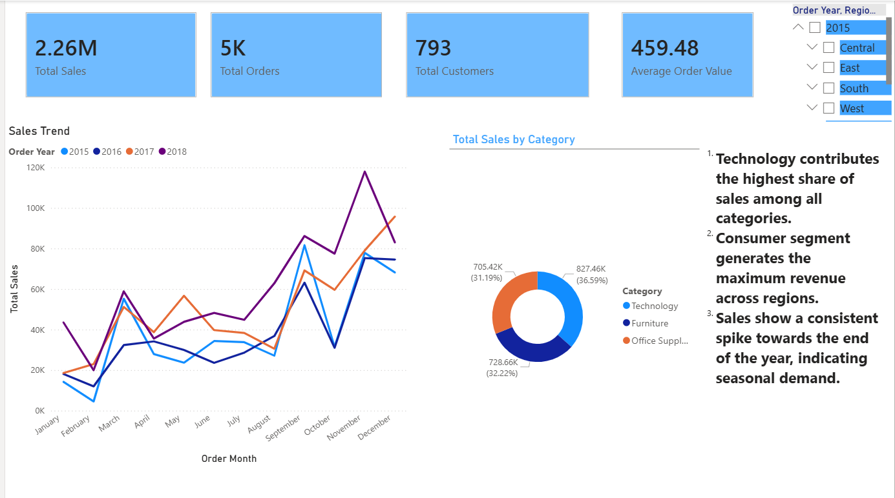

# Superstore Sales Analysis – Power BI

## 📌 Project Overview
This project focuses on analyzing retail sales data using Power BI to uncover insights related to sales trends, product performance, regional distribution, and customer segments.

## 📸 Dashboard Preview

### Sales Overview

### Product Analysis

### Regional Analysis

### Customer Segment Analysis

## 🧰 Tools & Technologies
- Power BI
- Power Query
- DAX
- Microsoft Excel

## 📊 Dashboard Pages
1. Sales Overview – KPIs and monthly sales trends
2. Product Analysis – Category and sub-category performance
3. Regional Analysis – Region and state-wise sales distribution
4. Customer Segment Analysis – Sales and customer behavior by segment

## 🔍 Key Insights
- Technology contributes the highest share of total sales.
- Sales peak towards the end of the year, indicating seasonal demand.
- The West region generates the highest total sales.
- Consumer segment contributes the highest overall sales volume, while Corporate customers have higher average order value.

## 🌐 Live Dashboard
👉 [View Live Power BI Dashboard](https://app.powerbi.com/groups/me/reports/caa3738f-f348-45a7-993e-09ae988284de/ebb86af159dac6c8a7a2?experience=power-bi)

## 📁 Files Included
- `.pbix` file containing the Power BI report
- Dataset used for analysis
- Dashboard screenshots for quick preview

## 📬 Author
Jishnu Pramod
